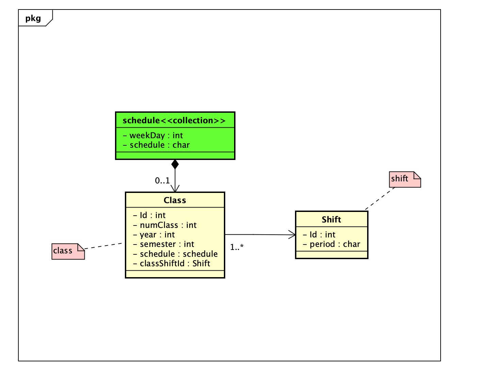

# Sistema de Gerenciamento de Turmas

Este é um projeto de API para um Sistema de Gerenciamento de Turmas, desenvolvido com Node.js, PostgreSQL, Docker e Swagger.

O objetivo deste sistema é permitir aos usuários realizar operações CRUD (Create, Read, Update, Delete) em turmas, permitindo a criação, leitura, atualização e exclusão das mesmas.

## Configuração do Ambiente de Desenvolvimento

Antes de executar o projeto, você precisa configurar o ambiente de desenvolvimento com as seguintes ferramentas:

- [Node.js](https://nodejs.org/)
- [PostgreSQL](https://www.postgresql.org/)
- [Docker](https://www.docker.com/)
- [Swagger](https://swagger.io/)

Certifique-se de instalar essas ferramentas em sua máquina antes de prosseguir.

## Instalação e Execução do Projeto

Siga as etapas abaixo para instalar e executar o projeto:

1. Clone este repositório em sua máquina local:

```bash
git clone <URL_DO_REPOSITÓRIO>
```

2. Rode o comando do docker para criar o container do banco de dados:

```bash
docker-compose up -d --build
```
3. Acesse o endereço http://localhost:3000/api-docs para acessar a documentação da API.

4. Diagrama Astah


